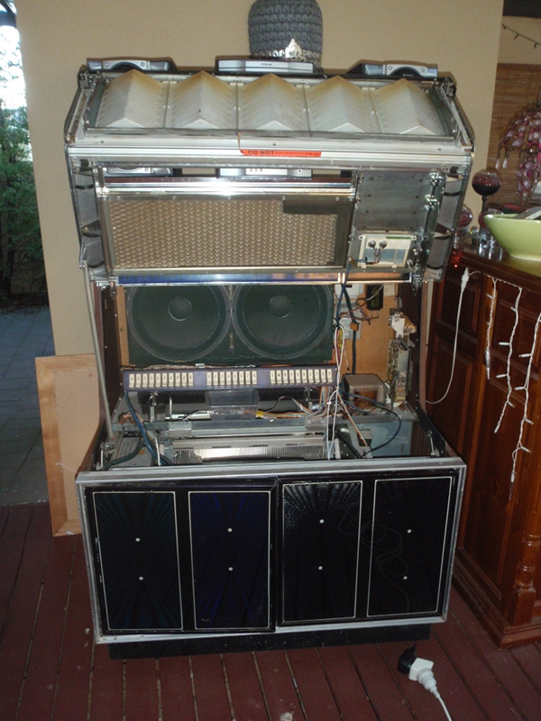
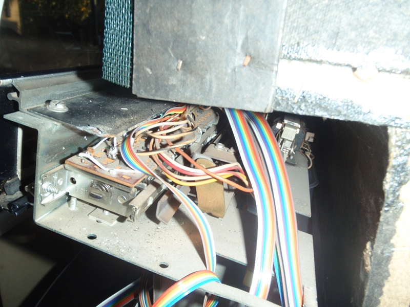
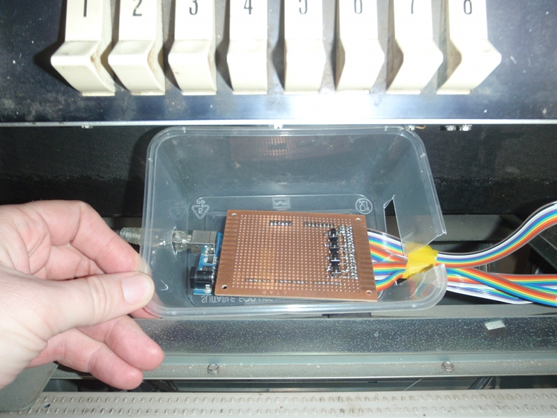
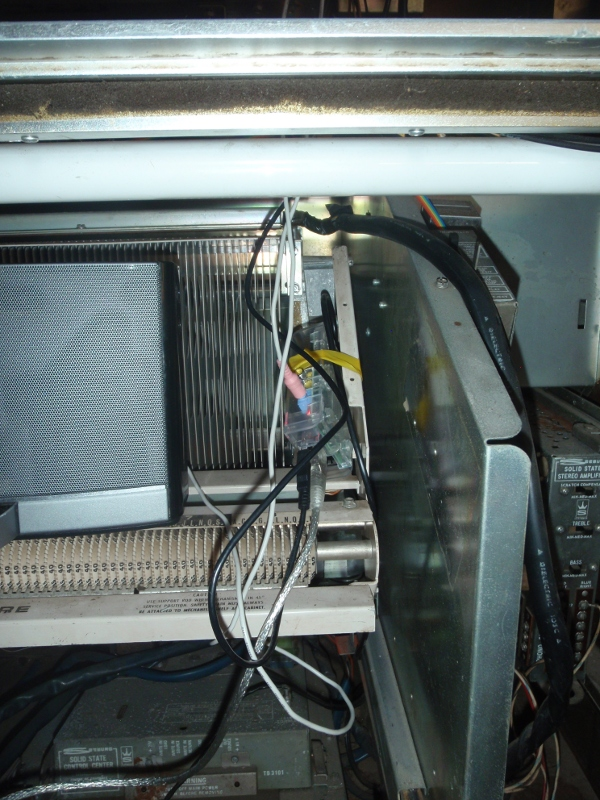
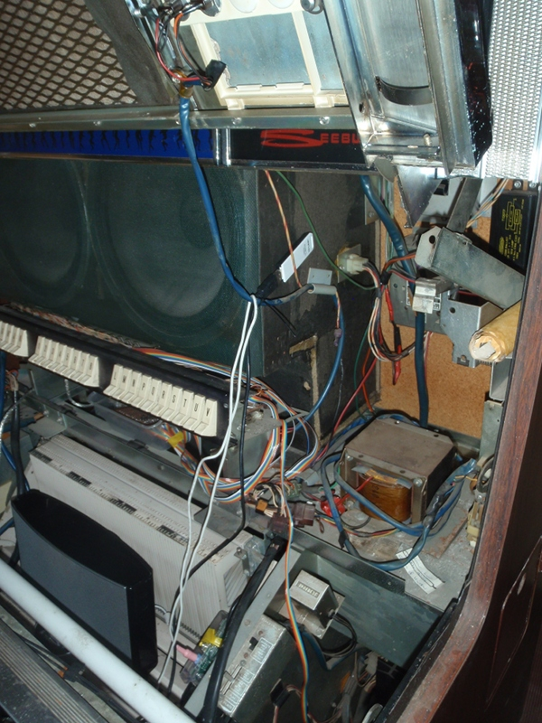

# Jukebox Revival

Reviving a classic jukebox.

## TL;DR
(aka "executive summary")

This *Seeburg Select-O-Matic Phonograph SS160* got a bit of a bump one day and stopped working:

Repairing the mechanical problem was prohibitive.

However, there is easy access and plenty of space in the case to install a ghost in the machine:

The mechanical selection switches are wired up with ribbon cable ...

...  to an Arduino Mega

The Mega scans the mechanical switches and reports to a Raspberry Pi:

A portable docking station provides plenty of sound, and a WiFi dongle allows remote control as well as managing songs:

## words...

The original aim was to repair the jukebox's mechanism and restore it to it's vinyl-playing glory. Failing that it was important that whatever was done didn't do further damage.

Apart from one retaining clip and a bunch of wires soldered to the switches the jukebox is in as-used condition!

The original plan was to multiplex the switches onto a few GPIO lines on a [Leostick](http://www.freetronics.com/products/leostick). It turns out the switches all have a common earth connection, multiplexing would have meant breaking those connections. The [Arduino Mega](http://arduino.cc/en/Main/ArduinoBoardMega) has more than enough GPIO pins to address the switches individually, so that's what I used.

The switches have a solenoid which I suspect retained the letter selection until a number was selected.
I suspect that this failed some time ago, as the owners were used to pressing and holding both a letter and a number to select a song.
I assumed the letter and number were selected individually the first version of the scanning code would go nuts when you pressed and held both, queueing the same song over and over again. Easy fix, once you know it's broken.

The Mega has few (dozen) GPIO pins left, as well as ADC.
Adding a few buttons (stop, pause, skip, ...) and a volume control would be nice.

The USB WiFi dongle connects to the home WiFi net.
Running as an open AP would make the jukebox more 'party friendly'
by allowing guests to queue music.

The [Raspberry Pi](http://www.raspberrypi.org/) listens to the Mega, provides the web-interface and plays selected songs through the portable docking station (which has surprisingly good sound, especially once the doors are closed).

It's running the default [Raspian](http://www.raspbian.org/) distro with a CGI [web interface](https://github.com/sprinkmeier/jukebox/blob/master/jukebox.cgi) and a [jukebox daemon](https://github.com/sprinkmeier/jukebox/blob/master/jukebox.py), both written in Python.

To the web-interface which can be used to upload, delete, queue and download songs. It also provides a CSV files listing all the songs in the right order to make printing labels easy.

## ToDo/Wishlist
  * Fake record changing sound-effects between tracks!
  * Lots of GPIO pins left for stop/skip/pause/play/shutdown buttons.
  * Lots of ADC for volume controls, or even an equalizer.
  * Extract the metadata from the songs. And do something sensible with it.
  * The web interface is ugly enough to qualify as a desperate cry for help.
  * Split the web interface into public (queue songs etc.) and private (authenticated, upload/download/delete songs etc.)
  * Re-use the chassis speakers rather than docking station.
  * Replace the neon tubes with LED strips.
  * Without all the hungry mechanics and neon tubes it should run nicely off a batteries.

As before any additions should have minimal impact.

Any ugliness in the design or implementation is hereby officially blamed on a rather tight deadline; the jukebox had to be ready to play at a birthday party (and it was!).

All code and schematics are on [GitHub](https://github.com/sprinkmeier/jukebox).

Questions? Comments? Patches? Contact me: [thomas.sprinkmeier@gmail.com](mailto:thomas.sprinkmeier@gmail.com).